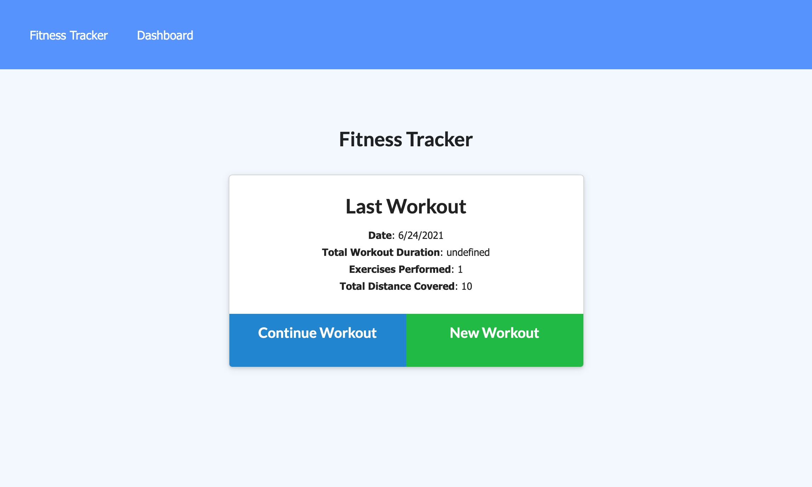
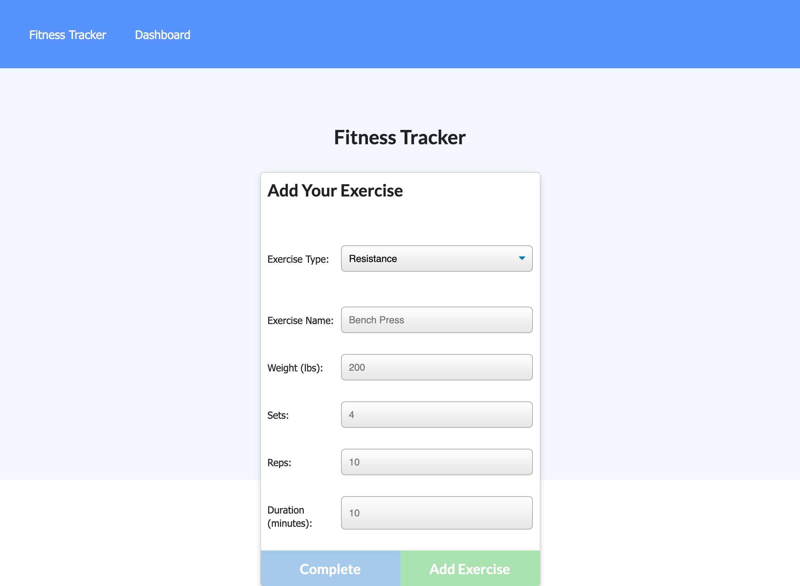
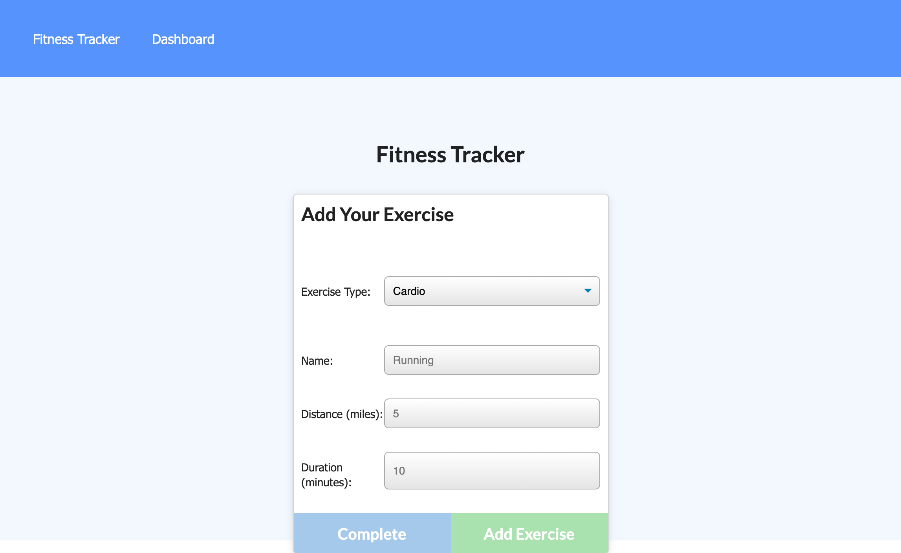
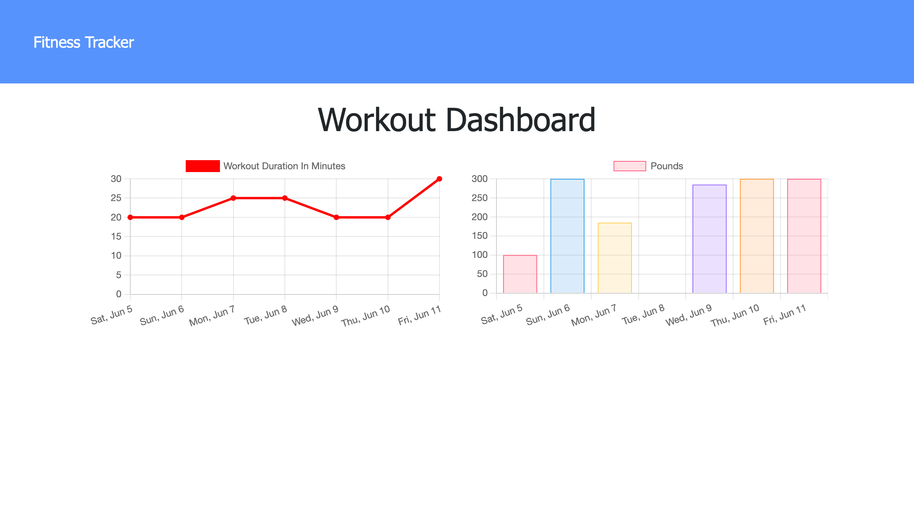

# fitness-tracker

## Description
When the user loads the page, they are given the option to create a new workout or continue with their last workout.
The user is able to:
* Add exercises to the most recent workout plan.
* Add new exercises to a new workout plan.
* View the combined weight of multiple exercises from the past seven workouts on the stats page.
* View the total duration of each workout from the past seven workouts on the stats page.

## Usage
This application is deployed through Heroku at the following link (https://shielded-bastion-63472.herokuapp.com/) and has the following functionality:

Home Page

Add a Resistance Workout

Add a Cardio Workout

Workout Dashboard

## Technologies Used
* NodeJS
* Express
* MongoDB
* Mongoose
* MongoDB Atlas Cloud
* Heroku

## License

MIT License

Copyright (c) [2021] [Sue Jin Kim]

Permission is hereby granted, free of charge, to any person obtaining a copy of this software and associated documentation files (the "Software"), to deal in the Software without restriction, including without limitation the rights to use, copy, modify, merge, publish, distribute, sublicense, and/or sell copies of the Software, and to permit persons to whom the Software is furnished to do so, subject to the following conditions:

The above copyright notice and this permission notice shall be included in all copies or substantial portions of the Software.

THE SOFTWARE IS PROVIDED "AS IS", WITHOUT WARRANTY OF ANY KIND, EXPRESS OR IMPLIED, INCLUDING BUT NOT LIMITED TO THE WARRANTIES OF MERCHANTABILITY, FITNESS FOR A PARTICULAR PURPOSE AND NONINFRINGEMENT. IN NO EVENT SHALL THE AUTHORS OR COPYRIGHT HOLDERS BE LIABLE FOR ANY CLAIM, DAMAGES OR OTHER LIABILITY, WHETHER IN AN ACTION OF CONTRACT, TORT OR OTHERWISE, ARISING FROM, OUT OF OR IN CONNECTION WITH THE SOFTWARE OR THE USE OR OTHER DEALINGS IN THE SOFTWARE.